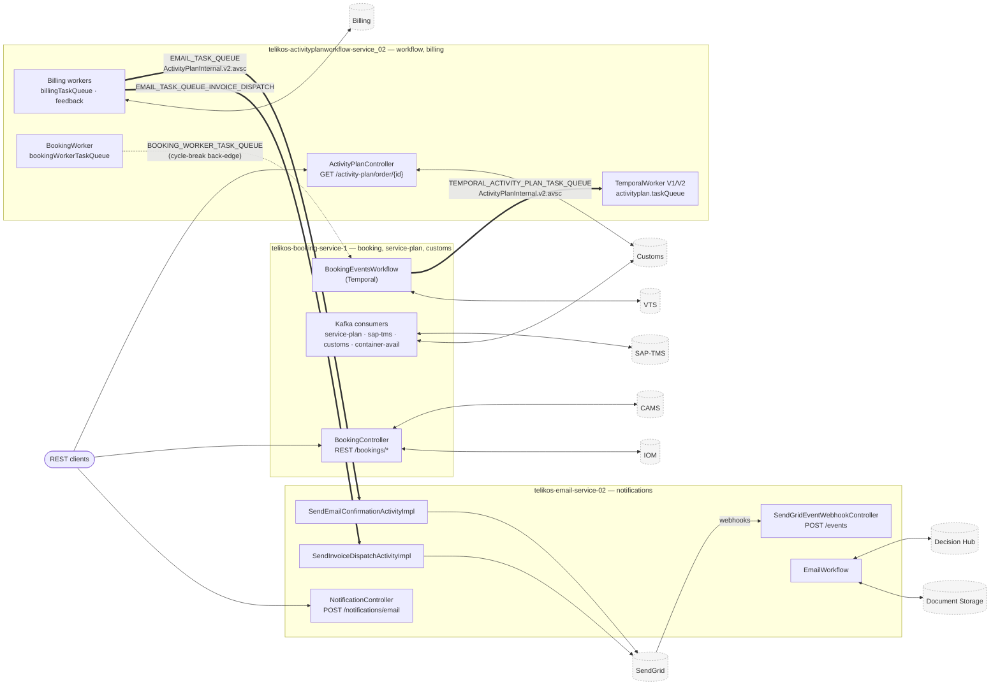
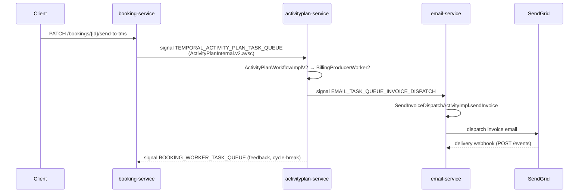

# booking-workspace — whole-system picture

> Agent-readable orientation map for architecture / cross-system / blast-radius tasks. Every node maps
> to a real `(source: path:line)` (see **Source map**). Routing source of truth stays
> `resolve-task.js` + the mini-skills — this diagram augments, never replaces, them.

## 1. Cross-repo system map (who connects to whom)

**Reading it:** thick `==>` edges are the cross-repo temporal-signal contracts the resolver tracks for
blast-radius; the dotted `-.->` edge is the AP→booking feedback loop **broken out of the topo order**
(`cycle_breaks` in `workspace.yml`) but still honoured by the Reviewer. Topo order:
`booking → activityplan → email`.

## 2. Canonical cross-repo flow — invoice-dispatch email (touches all 3)

## 3. Source map (every node → verified source:line)

| Node | Repo | Source |
|---|---|---|
| BookingController REST | booking | `service/.../api/controller/BookingController.java:102` |
| Kafka consumers | booking | `service/.../events/consumer/KafkaConsumerService.java:36`, `CustomsServiceOrderConsumer.java:27` |
| BookingEventsWorkflow | booking | `service/.../temporal/workflow/BookingEventsWorkflow.java:12` |
| ActivityPlanController | activityplan | `api/.../controller/ActivityPlanController.java:37` |
| TemporalWorker V1/V2 | activityplan | `workflow/.../worker/TemporalWorker.java:132` (V1), `:137` (V2) |
| Billing workers | activityplan | `workflow/.../worker/BillingProducerWorker.java:16`, `BillingProducerWorker2.java:16`, `BillingWorker.java:31` |
| BookingWorker | activityplan | `workflow/.../worker/BookingWorker.java:17` |
| NotificationController | email | `service/.../api/controller/NotificationController.java:37` |
| SendGridEventWebhookController | email | `service/.../api/controller/SendGridEventWebhookController.java:29` |
| SendEmailConfirmationActivityImpl | email | `.../workflow/activity/SendEmailConfirmationActivityImpl.java:20` |
| SendInvoiceDispatchActivityImpl | email | `.../workflow/activity/SendInvoiceDispatchActivityImpl.java:17` |
| EmailWorkflow | email | `service/.../email/workflow/EmailWorkflow.java:12` |

**Cross-repo contracts** (from `_global_links.json` / `workspace.yml`):

| Topic | Producer → Consumer | Schema |
|---|---|---|
| `TEMPORAL_ACTIVITY_PLAN_TASK_QUEUE` | booking → activityplan | `ActivityPlanInternal.v2.avsc` |
| `EMAIL_TASK_QUEUE` | activityplan → email | `ActivityPlanInternal.v2.avsc` |
| `EMAIL_TASK_QUEUE_INVOICE_DISPATCH` | activityplan → email | _(no avsc — POJO signal)_ |
| `BOOKING_WORKER_TASK_QUEUE` | activityplan → booking | _(cycle-break back-edge)_ |

> Regenerate this file whenever the underlying `navigation/entry-points.md`, `integrations/*`, or
> `_global_links.json` change (the drift ledger triggers it) — it then stays in lock-step with the
> agent's truth.
