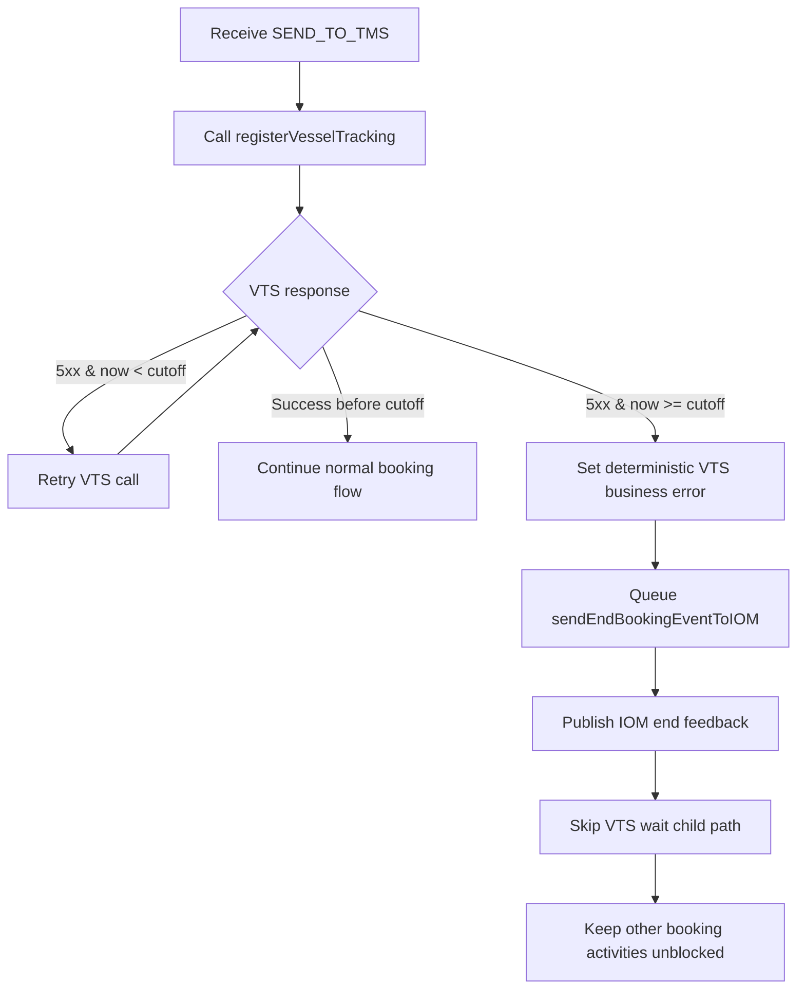

# Plan: VTS 5xx Retry Until Cutoff and Error Fan-out to IOM [Feature]

## Stack
- **Build:** Maven
- **Language:** Java
- **Stack:** WebFlux
- **CT Module:** present

- 

## Overview
**Objective:** Ensure VTS registration handles HTTP 5xx failures with continuous retry until the booking-specific VTS cutoff/deadline, and send error completion to IOM **only after cutoff is reached**. Retry/error handling must stay isolated to the VTS branch so other booking activities are not blocked or held. No cross-repo contract changes in this iteration.

### Request Flow
Booking Event (SEND_TO_TMS) -> `registerVesselTracking` activity -> VTS API call
-> [5xx and now < cutoff] keep retrying VTS call in-loop
-> [success before cutoff] continue normal booking flow
-> [still 5xx and now >= cutoff] stop retry loop, mark deterministic business error on ServicePlan, queue `sendEndBookingEventToIOM`
-> publish end feedback to IOM
-> do NOT arm/start `VtsWaitChildWorkflow` for this path
-> do NOT block unrelated booking activities while this retry/error branch executes

**Success Criteria:**
- [ ] VTS 5xx responses are retried continuously while current time is before computed VTS cutoff/deadline.
- [ ] No error completion is sent to IOM before cutoff; error is sent only once cutoff is reached/exceeded with persistent 5xx.
- [ ] On cutoff-exhausted 5xx, booking is persisted with deterministic VTS business error and `sendEndBookingEventToIOM` is triggered.
- [ ] 5xx-cutoff path does not start VTS wait child workflow and does not block/hold other booking activities.

**Boundaries:** Always: keep existing non-5xx behavior and existing VTS feedback flow intact | Always: keep all changes within this repo only | Never: change cross-repo Kafka/API contracts or unrelated workflow routes in this repo iteration.

## Implementation Tasks
### Task 1: Enforce continuous cutoff-aware 5xx retry behavior in VTS registration activity
- **Files:** MODIFY `service/src/main/java/net/apmoller/crb/telikos/microservices/booking/temporal/activity/VesselTrackingRegistrationActivityImpl.java`
- **AC:** VTS registration keeps retrying HTTP 5xx without early error fan-out while `now < cutoff`; exits retry loop only when success occurs or cutoff is reached.
- **Verify:** compiles, no checkstyle violations

### Task 2: Send IOM error only at/after cutoff and isolate this error branch
- **Files:** MODIFY `service/src/main/java/net/apmoller/crb/telikos/microservices/booking/temporal/activity/VesselTrackingRegistrationActivityImpl.java`, `service/src/main/java/net/apmoller/crb/telikos/microservices/booking/temporal/model/BookingActivity.java`, `service/src/main/java/net/apmoller/crb/telikos/microservices/booking/temporal/activity/UpdateVesselRailAvailabilityDateActivityImpl.java`, `service/src/main/java/net/apmoller/crb/telikos/microservices/booking/common/BookingConstants.java`, `service/src/main/java/net/apmoller/crb/telikos/microservices/booking/common/ErrorConstants.java`
- **AC:** If 5xx persists to cutoff, ServicePlan carries deterministic business exception and workflow schedules `sendEndBookingEventToIOM`; before cutoff no IOM error send occurs.
- **AC:** Retry/error handling in this VTS branch is isolated so unrelated booking activities are not blocked/held.
- **Verify:** compiles, no checkstyle violations

### Task 3: Preserve workflow compatibility and avoid cross-repo contract impact
- **Files:** VERIFY/MODIFY ONLY IF REQUIRED `service/src/main/resources/application.yml`, `service/src/main/java/net/apmoller/crb/telikos/microservices/booking/temporal/workflow/BookingEventsWorkflowImplementation.java`
- **AC:** Existing activity-chain semantics remain compatible for in-flight runs; behavior change remains internal to this repo and does not require external contract changes.
- **Verify:** compiles, no checkstyle violations

### Task 4: Add/adjust unit tests for retry-until-cutoff, cutoff-gated error fan-out, and isolation
- **Files:** MODIFY `service/src/test/java/net/apmoller/crb/telikos/microservices/booking/temporal/activity/VesselTrackingRegistrationActivityImplTest.java`, `service/src/test/java/net/apmoller/crb/telikos/microservices/booking/temporal/activity/UpdateVesselRailAvailabilityDateActivityImplTest.java` (create if absent)
- **AC:** Unit tests assert retry continuation before cutoff, no pre-cutoff IOM error send, cutoff-exhausted error path to IOM, and no VTS wait child start in cutoff-exhausted 5xx flow.
- **AC:** Unit tests assert unaffected progression of other booking activities while VTS retry branch is active.
- **Verify:** `mvn -f service/pom.xml test`

## Unit Test Matrix
| # | Class Under Test | Business Scenario | Expected Behavior |
|---|------------------|-------------------|-------------------|
| 1 | `VesselTrackingRegistrationActivityImpl` | VTS returns repeated 5xx while current time remains before cutoff | Activity keeps retrying; no IOM error fan-out is triggered before cutoff |
| 2 | `VesselTrackingRegistrationActivityImpl` | VTS returns 5xx initially, then success before cutoff | Retries occur; success response is processed; no cutoff error raised |
| 3 | `VesselTrackingRegistrationActivityImpl` | VTS keeps returning 5xx until cutoff is reached/exceeded | Retry loop stops at cutoff boundary; activity emits cutoff-exhausted error signal/state |
| 4 | `UpdateVesselRailAvailabilityDateActivityImpl` | Cutoff-exhausted VTS error state enters update activity | Business exception persisted and additional execution includes `sendEndBookingEventToIOM` |
| 5 | `VesselTrackingRegistrationActivityImpl` + workflow integration seam | Cutoff-exhausted 5xx flow | `VtsWaitChildWorkflow` is not started/signalled for this path |
| 6 | Workflow/activity chain behavior | VTS retry branch active for one booking | Other booking activities are not blocked/held by this retry/error handling path |

## Component Test Scenarios
> CT_MODULE: present
> Mock request/response data must be confirmed by human before execution.

### Scenario 1: VTS transient 5xx recovers before cutoff
Given a booking in SEND_TO_TMS with valid VTS cutoff source date
When VTS registration returns 5xx repeatedly and then succeeds before cutoff
Then booking processing continues without VTS cutoff error, and no end-error event is sent to IOM before cutoff

### Scenario 2: VTS persistent 5xx until cutoff sends error to IOM without VTS wait hold
Given a booking in SEND_TO_TMS with valid VTS cutoff source date
When VTS registration keeps returning 5xx until cutoff is reached/exceeded
Then booking is persisted with VTS failure business exception and end-event is sent to IOM only at/after cutoff, and VTS wait child workflow is not armed for this path

### Scenario 3: Isolation of VTS retry/error branch
Given concurrent booking activity execution paths
When one booking remains in VTS 5xx retry loop before cutoff
Then unrelated booking activities continue and are not blocked/held by that retry/error handling branch

## Risks
| Risk | Impact | Mitigation |
|------|--------|------------|
| Cutoff comparison bug causes early IOM error send | Premature terminal feedback | Add explicit UT assertions for pre-cutoff no-send and cutoff-boundary send |
| Retry loop interferes with other booking progression | Throughput/latency regression | Keep retry/error state local to booking-specific VTS branch; verify with isolation-focused UT/CT |
| Temporal behavior drift for in-flight workflows | Runtime regression | Keep change inside activity logic/flags; avoid workflow signature/signal contract changes |

## Implementation Flow Diagram

## Implementation Order
services/activity logic → workflow branching flags → constants/error mapping → unit tests → component tests

